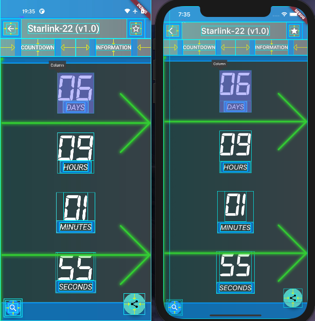
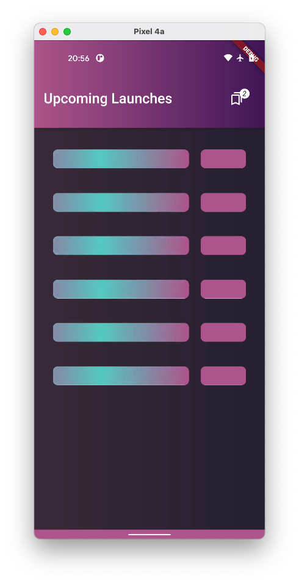
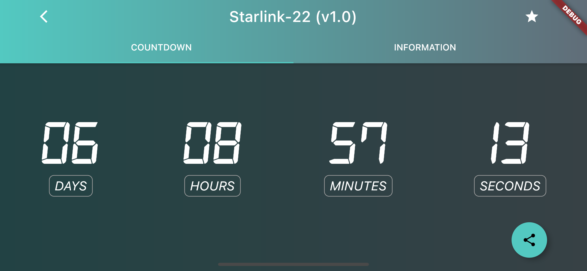
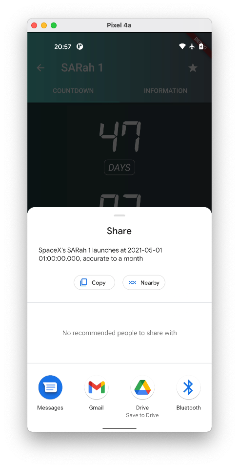
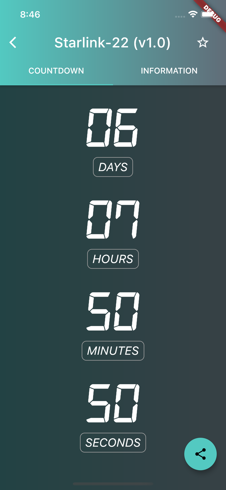

# :dizzy: :alien: :rocket: space_time :dizzy: :alien: :rocket:

SpaceX rocket launch times viewer by Ben Butterworth.

### To install
- I did not commit build files to the git repo. You can download the repo which contains **pre-built files (APK for Android/ .app for iOS)** from [here](https://drive.google.com/file/d/1x15vq25Dxg9EmJ_MVcZR34RdHKh4GJM1/view?usp=sharing).
- Android: `cd space_time`, Plug in a device with debug mode or run emulator, followed by `adb install public/SpaceTime.apk`
- iOS: Drag `public/SpaceTime.app` onto an emulator
- Or, just **build and run it**.

### My solution
- I found that the SpaceX Upcoming Launches API gave launch dates to varying precision (accurate to 1 month, accurate to 1 year, etc), so I handled date precision: some dates are "relative" (e.g. in a day) when they are more precise, but others are months/ years (e.g. May) when they are less precise. 
- I initially implemented the header (`Launch`, `date/ UTC`), but realized the content speaks for itself once the dates are provided in a human friendly format.
- I don't use `const Widget` because I have not found a performance benchmark for it, have you? It will likely increase memory usage but improve speed for AOT builds. (though most likely these effects are negligible).

### I discovered an inconsistency between iOS and Android:
Notice there is a gap between `06` and `DAYS` on iOS, but not Android. This is because the text baselines are inconsistent. See [16257](https://github.com/flutter/flutter/issues/16257) for more information.

### More images

See `/images/ios` and `images/android` for more images.

### Resources & licenses
- Digital-7 font used for countdown was taken from https://www.dafont.com/digital-7.font - free for personal use

### Oops
There are no tests. I got too engrossed in trying out different flutter features. Perhaps my private repo https://github.com/ben-xD/SpaceTime will have the tests? :sparkles: :poop:

# Readme from gohenry :speech_balloon:

### Objective

Your assignment is to create an app showcasing and notifying visitors about
the next SpaceX rocket launch, and displaying details about next launches.
Use Dart and Flutter.

### Brief

You're the last app developer on earth. Everyone is leaving and going to Mars,
to live a safer, cooler life there. The one problem is, people need to know when the next launch
is happening, and that's where you come in the picture. You need to build an app that informs
the public about the next launch, and give them information about future launches.
Everyone is counting on you, go create that app.

### Tasks

- Implement assignment using:
  - Language: **Dart**
  - Framework: **Flutter**
- Build out the project to the designs inside the `/Designs` folder
- Connect your application to the **SpaceX-API** (Docs and playground: `https://docs.spacexdata.com/?version=latest`)
- Use the API to build two screens/sections like in the design
- The countdown should be live and specify days, hours, minutes and seconds
- The 'Upcoming Launches' screen/section should display the mission name and date, like in the design
- The countdown and upcoming launches table can be implemented either in separate screens (implement navigation), make them intuitive and fluid
- Add a share buttons for social media platforms, to share the next launch with friends
- Fetching should be done safely, with a fallback when an error occurs
- Each launch should have a 'Bookmark' or 'Favourite' button, that adds it to a separate 'Favourites'
  table/screen. Implement using local storage (either save the launches data or its id for
  later fetching)

### API Endpoints

- Next Launch Counter: 'https://api.spacexdata.com/v4/launches/next'
- Upcoming Launches: 'https://api.spacexdata.com/v4/launches/upcoming'

With these endpoints, a simple GET request will provide you all the data needed for the tasks, no authentication required.

### Deliverables

Make sure to include all source code in the repository. To make reviewing easier, include a fully built version of your assignment in a folder named **public**.

### Evaluation Criteria

- **Dart** best practices
- MVC or MVVM design patterns
- Efficient use of packages to speed up development
- Show us your work through your commit history
- Completeness: did you complete the features?
- Correctness: does the functionality act in sensible, thought-out ways?
- Maintainability: is it written in a clean, maintainable way?
- Testing: is the system adequately tested? do your components have unit tests?
- Responsiveness and full iOS/Android compatibility
- Elegantly use placeholders/skeletons when fetching data

### CodeSubmit

Please organise, design, test and document your code as if it were
going into production - then push your changes to the master branch. After you have pushed your code, you may submit the assignment on the assignment page.

All the best and happy coding,

The gohenry Ltd. Team